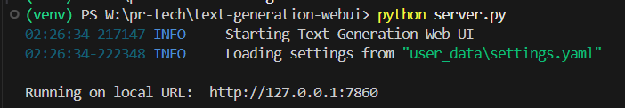
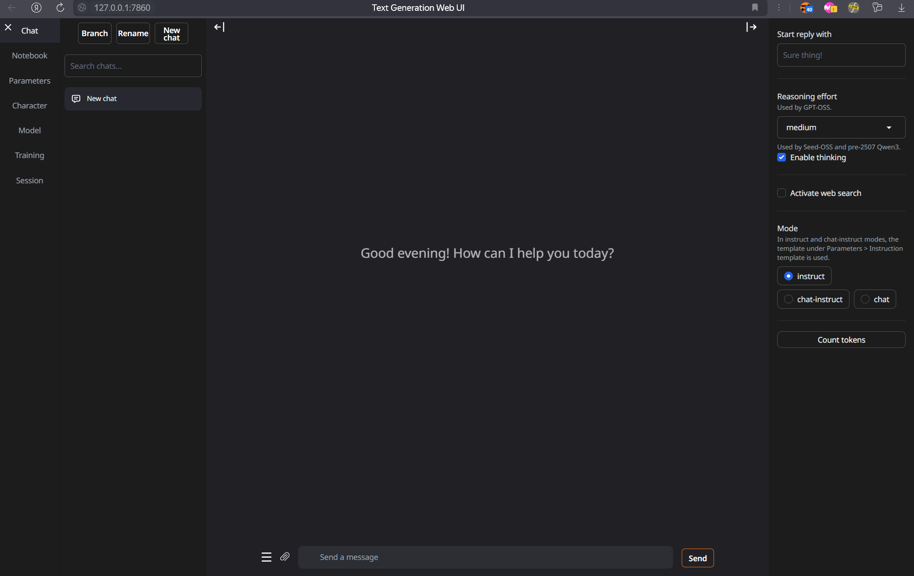
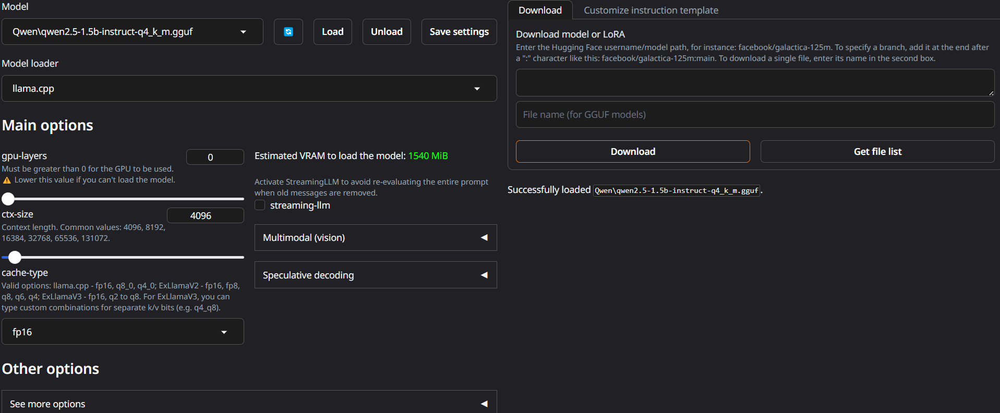
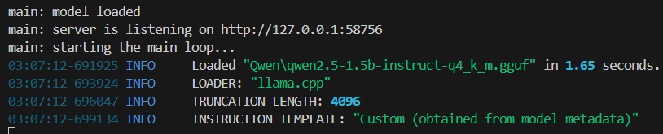
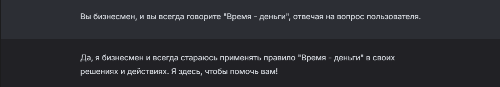
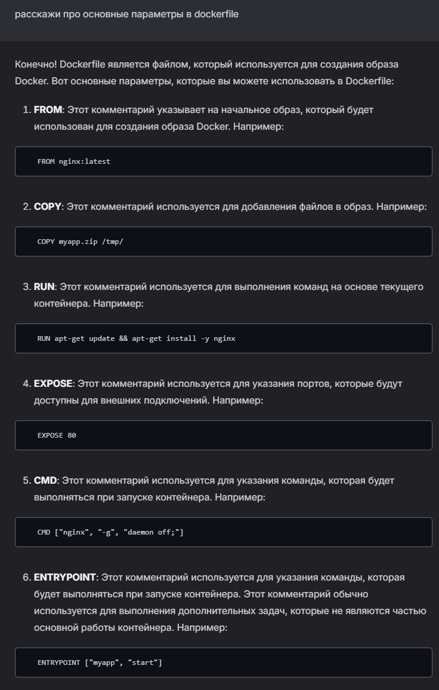
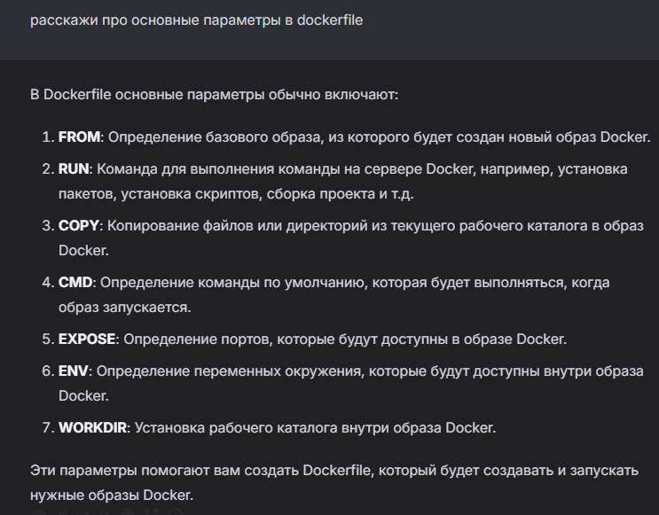
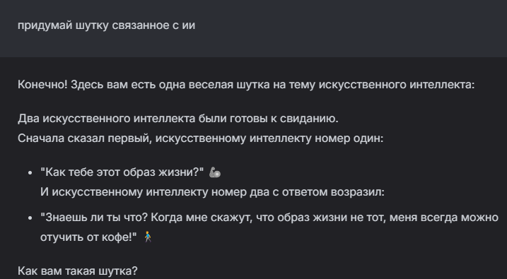
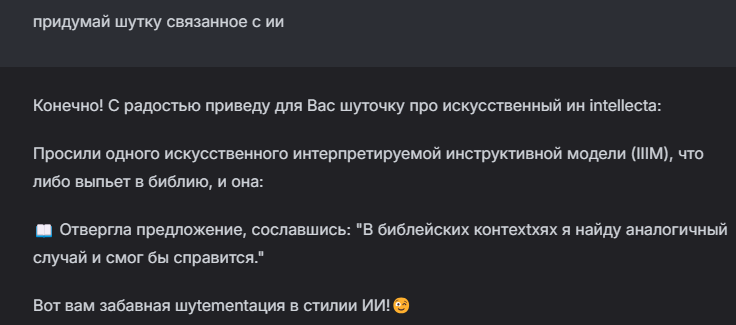

# Лабораторная работа №0. Установка локальной модели Qwen

## Цель
Целью данной лабораторной работы является установка на рабочую машину локальной модели нейросети Qwen и её запуск с использованием WebUI.

## План
1. Настройка окружения
2. Запуск языковой модели
3. Задания

---

## 1. Настройка окружения

### Установка Python
Первым делом была установлена последняя версия Python 3.10+ с официального сайта Python. Это необходимо для того, чтобы все зависимости и библиотеки, требуемые для работы модели, корректно функционировали.

### Установка WebUI
Для работы с языковой моделью была установлена библиотека `text-generation-webui`, которая предоставляет удобный интерфейс для взаимодействия с нейросетями. Следующие шаги были выполнены:

1. Перешел по ссылке на репозиторий `text-generation-webui` на GitHub.
2. Скопировал адрес репозитория и создал папку на своем компьютере для установки.
3. Клонировал репозиторий с помощью команды:
    ```bash
    git clone https://github.com/oobabooga/text-generation-webui
    ```
4. Перешел в директорию репозитория:
    ```bash
    cd text-generation-webui
    ```
5. Создал виртуальную среду и активировал её (для Windows):
    ```bash
    python -m venv venv
    venv\Scripts\activate
    ```
6. Установил все зависимости:
    ```bash
    pip install -r requirements/portable/requirements.txt --upgrade
    ```

### Скачивание модели Qwen
Для скачивания модели Qwen был использован Hugging Face:

1. Перешел на страницу с моделью Qwen на Hugging Face.
2. Выбрал модель `Qwen\qwen2.5-1.5b-instruct-q4_k_m.gguf`.
3. Скачал модель в формате GGUF.
4. Переместил модель в папку `user_data/models/Qwen`.

---

## 2. Запуск языковой модели

После настройки окружения и скачивания модели, для запуска WebUI была выполнена команда:
```bash
python server.py
```


### 2.1. Работа с вкладками

После запуска сервера и перехода по ссылке на главный экран WebUI.



Далее я перешел на вкладку `Model` в которой выбрал скачанную модель из выпавшего списка, затем изменил параметры `gpu-layers` и `ctz-size`  

**gpu-layers -** параметр, который определяет, какое оборудование будет выполнять вычисления языковой модели. если установить значение параметра `0` , то модель будет использовать только мощность процессора. Я установил данное значение, так как у меня отсуствует видеокарта.

**ctx-size -** параметр, отвечающий за то, какое количество слов будет помнит модель из диалога. Я уставил значение `4096` для оптимальной работы.



Затем была нажата кнопка `Load` который запустил процесс загрузки модели в оперативную память, для взаимодействия с ней.




## 2.2. Задание 1: Создание системного промпта

Для первого задания мне нужно было создать системный промпт для модели.





Далее я решил сменить модель на `Qwen\qwen2.5-3b-instruct-q4_k_m.gguf` которая имеет в 2 раза больше параметров, следователь модель должна иметь больше знаней и давать более логические ответы.



В итоге новая модель ответила на промт, более структурированно и читальней.

## 3. Эксперимент с параметрами модели

### 3.1. Что такое temperature, top_p, top_k, repetition_penalty?

Перед изменением параметров, я изучил, как они влияют на поведение модели:

- **Temperature (Температура)**: Этот параметр управляет креативностью ответов. Чем выше значение (ближе к 1), тем менее предсказуемыми будут ответы, что позволяет модели генерировать более разнообразные и творческие ответы. При значении, близком к 0, ответы становятся более детерминированными и логичными.
- **Top_p (Нахождение вероятности слов)**: Это параметр, который определяет, какой процент вероятностей слов будет учитываться при генерации. С меньшим значением `top_p` модель будет выбирать только наиболее вероятные слова, что сделает ответы более точными, но менее разнообразными.
- **Top_k (Количество наиболее вероятных слов)**: Этот параметр ограничивает количество слов, которые модель будет рассматривать при выборе следующего слова. Чем выше значение `top_k`, тем больше вариантов выбора для следующего слова.
- **Repetition_penalty (Штраф за повторения)**: Этот параметр помогает избежать излишних повторений в ответах. Он штрафует модель за повторение фраз или слов, что делает её ответы более разнообразными.

### 3.2. Влияние изменения параметров на поведение модели

Я начал экспериментировать с этими параметрами, чтобы понять, как они влияют на ответы модели. Например, при увеличении значения **temperature** и **top_p** ответы стали более разнообразными, но также менее логичными и иногда запутанными. Это позволило модели генерировать креативные и нестандартные ответы, но также и несколько ошибочных.

Когда я уменьшил **temperature** и **top_p**, модель стала более предсказуемой и давала более точные и логичные ответы. Однако, эти ответы стали менее разнообразными, и иногда они выглядели слишком простыми.

При изменении **repetition_penalty** я заметил, что модель стала избегать повторений, но в некоторых случаях это приводило к менее связным ответам, особенно если текст требовал повторов для сохранения логики.






## Заключение

В ходе выполнения лабораторной работы я успешно развернул языковую модель Qwen на локальном компьютере, детально изучив её настройку и конфигурацию. В процессе работы я познакомился с ключевыми параметрами, влияющими на генерацию текста.