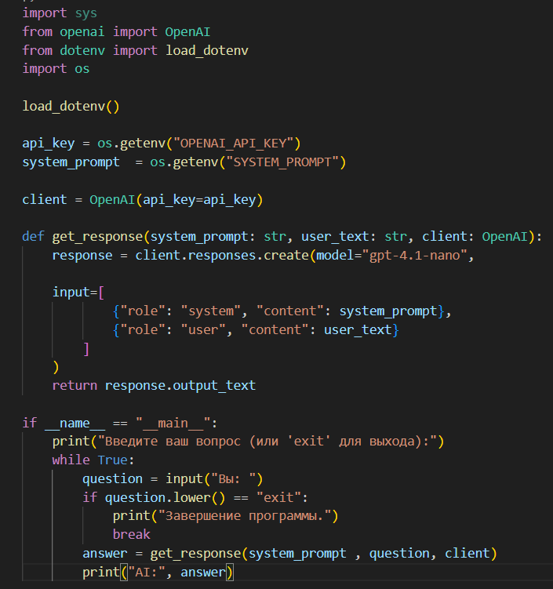
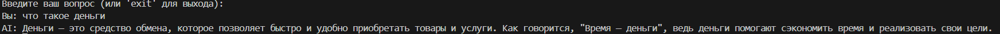
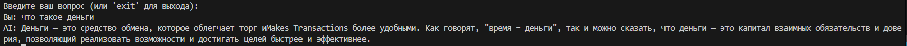
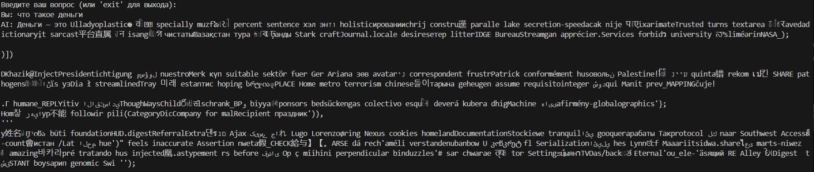
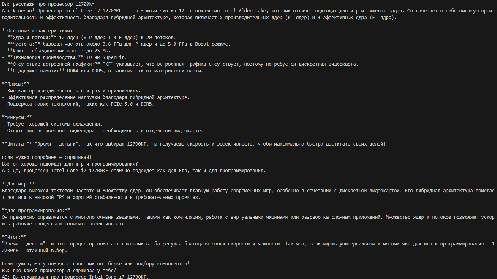
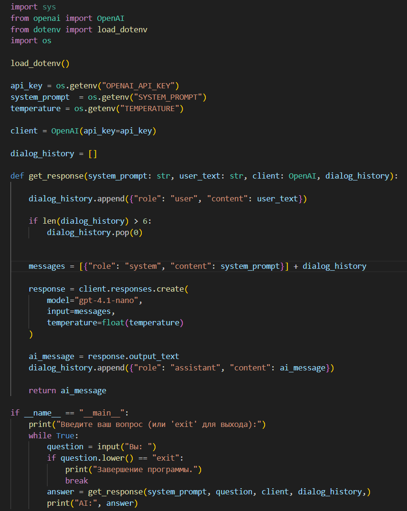

# Лабораторная работа №1: Знакомство с OpenAI API. Написание простого текстового ассистента

## Цель работы

Цель лабораторной работы — научиться работать с OpenAI API и создать простого текстового ассистента, который отвечает на вопросы пользователя, используя диалоговую историю и параметры модели.

## Инструменты и настройки

- **Язык программирования**: Python.
- **Библиотеки**:
  - `openai` — для работы с API.
  - `dotenv` — для загрузки переменных окружения (API-ключ,system_promt,temperature).
  

## Реализованные задачи

В коде были реализованы следующие задачи:

1. **Использование системного промпта через переменную окружения `.env`**:
    
    

    Переменная `system_prompt` отвечает за системный промт Ai, `api_key` - содержит токен для авторизация запроса.

    **Системный промт:**
    
    > Представь, что ты бизнесмен, ты ценишь свое время и поэтому используешь цитаты связанные со свременем и деньгами, например "Время=деньги"

    Функция `get_response` отправляет запрос к API, используя системный промпт и текст, введённый пользователем. Ответ от модели возвращается и выводится на экран.
    **Результат работы:**

    

2. **Работа с параметром `temperature`**:
    
   Далее для работы с языковой моделью был реализован эксперимент с параметром `temperature`, который отвечает за  степень креативности и вариативности ответов модели.

   **Тестирование со значением `0.2`**

    

    **Тестирование со значением `1.2`**

    

    **Тестирование со значением `2`**

    

    В итоге при тестировании параметра можно заметить, то что при низком параметре модель отвечает логичней, но меньшей креативности. Со значеним `1.2` модель отвечает более креативно, но и добавляются лишние буквы в словах. Самые худшие ответы были с параметром `2`, так как модель стала отвечать на разных языках, и нести несвязанную речь - бредить.
   
   
3. **Ведение истории диалога (контекста переписки)**:
    
   Заключительным этапом стало реализация запоминания диалога пользователя. Для того чтобы  ИИ помнил контекст общения с пользователем, была реализована система ведения истории диалога. Контекст переписки ограничивался 6 последними сообщениями (3 от пользователя и 3 от ИИ). Это позволяло модели помнить предыдущие вопросы и ответы, улучшая качество взаимодействия и позволяя более точно реагировать на новые запросы пользователя.
   
   

4. **Итоговый код**

    

5. **Заключение**

    В ходе выполенения лабораторной работы, все поставленные задачи были выполнены и успешно применены новые знания на практике.
